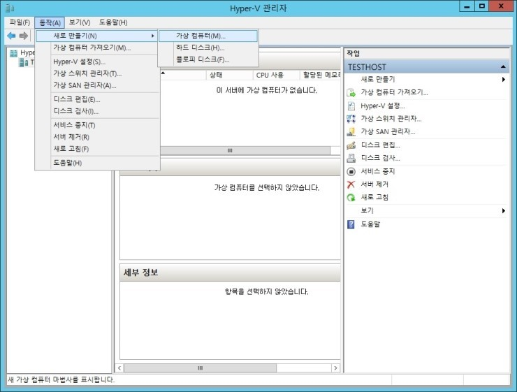

# Prime Mover 교육과정 #

​    고객서비스본부 고객5G&CoE팀 진광철

------

[TOC]

------

### 2. Hyper-V 활용 VM 만들기

- Hyper-V 실행

  .png)

- 가상 Switch 생성(Hyper-V관리자 > 가상스위치 관리자)

  .png)

- 내부 스위치로 생성 (내부 가상 스위치 이름 입력 ex : Hyper-V Internal NAT)

  .png)

- 가상 컴퓨터 만들기

  

- 새 가상 컴퓨터 마법사

  .png)

- 이름 및 위치 지정 (전체 3개 Node 생성 : Master, Worker1, Worker2)

  .png)

- 세대지정

  .png)

- 메모리 할당 (Master Node는 최소 2GB, Worker Node는 1GB 가능)

  .png)

- 네트워크 구성 : 생성한 가상 스위치 지정(ex : Hyper-V Internal NAT)

  .png)

- 가상 하드 디스크 지정 : 가상 하드 디스크 만들기로 진행, Master Node의 경우 30GB, Worker Node의 경우 10GB 권장

  .png)

- 가상 하드디스크 설치 옵션 : CentOS 설치 Image 선택

  .png)

- Virtual Machine 생성 요약 정보 및 마침

  .png)

- 생성된 가상 컴퓨터 확인

  .png)

- Master Node Core 수 변경 : Master Node는 최소 2Core 이상, Worker Node는 1Core만으로도 가능

  - Master 가상 컴퓨터 선택 > 오른쪽 "설정" 메뉴 선택
  - "프로세스" 선택 > 가상프로세스 수 "2" 입력 (PC의 세대에 따라 프로세스 갯수는 2개 이상 가능)

  .png)

