### 3. CentOS 설치

- Master 가상 컴퓨터 선택 후 오른쪽 버튼 클릭 "연결" 메뉴 선택

  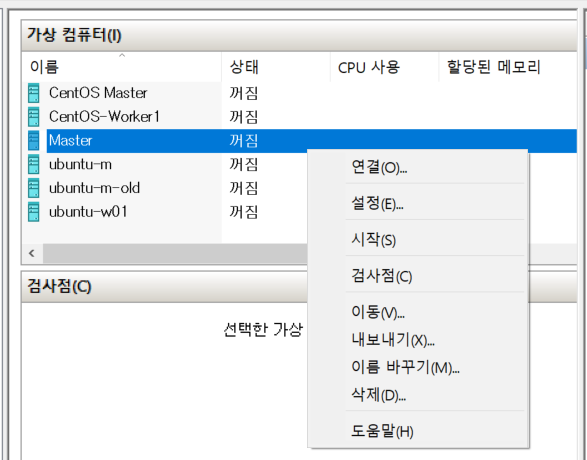

- 시작 화면에서 "시작" 클릭

  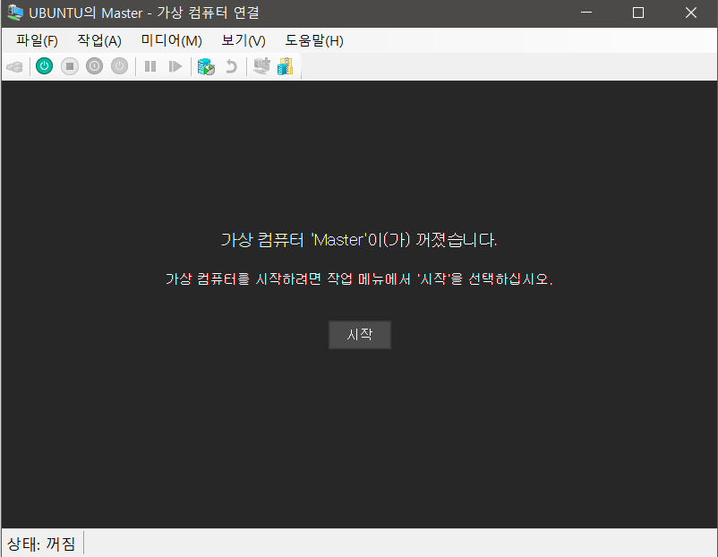

- CentOS 설치 : Install. ...

  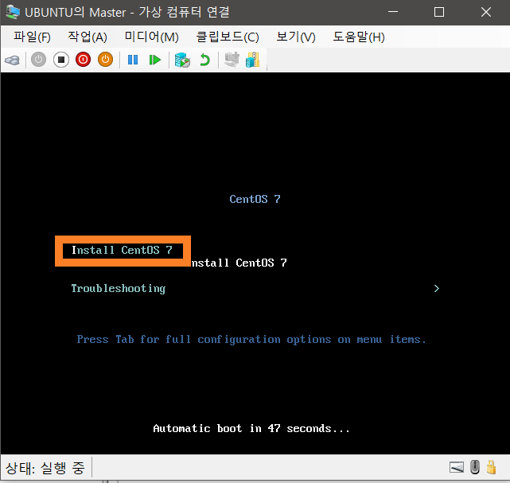

- 설치전 System Checking 

  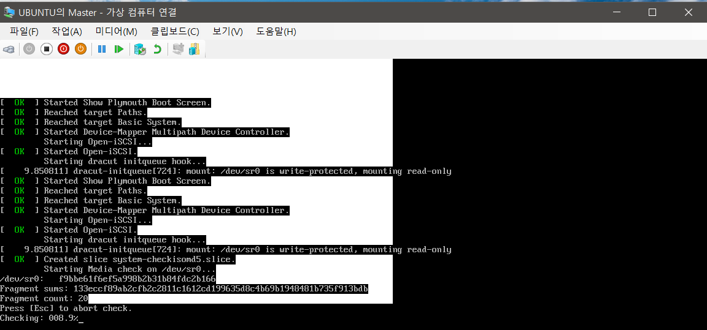

- 설치 언어 선택 : English

  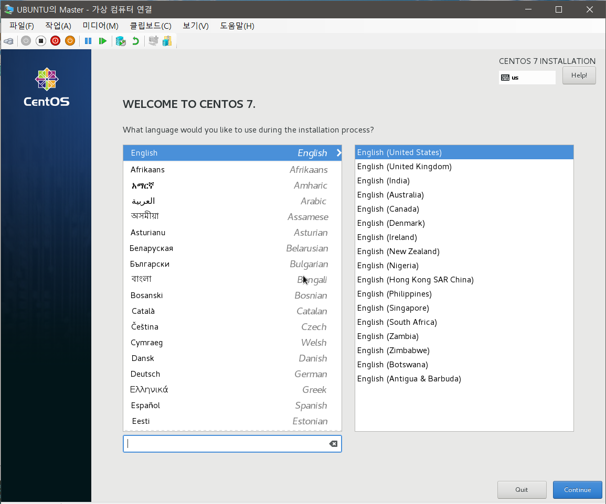

- 설치할 hard disk 선택 > Disk 선택 > Done

  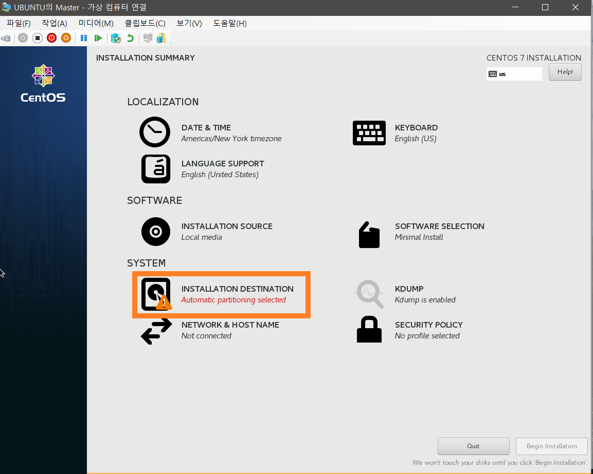

  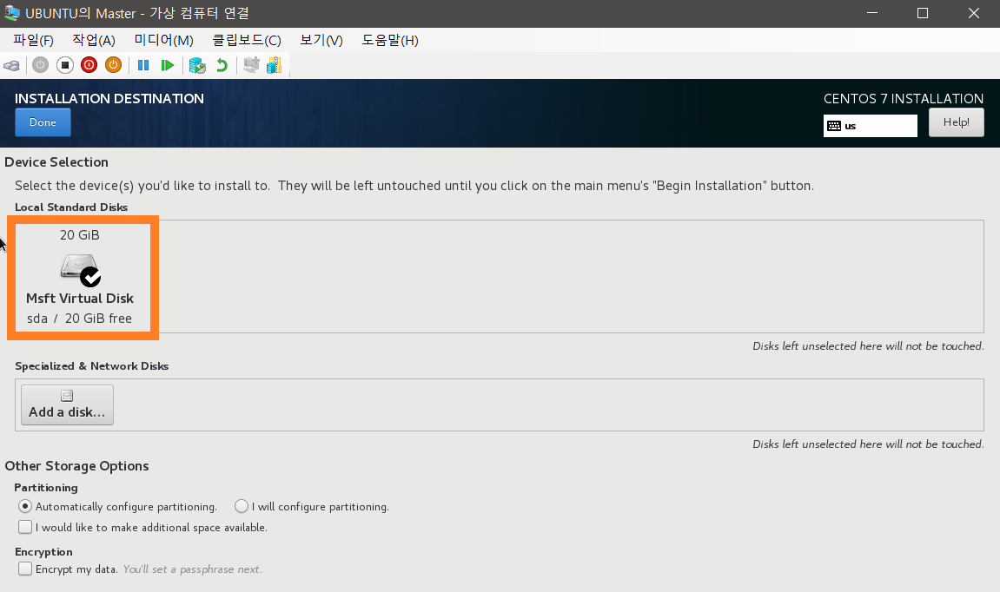

- Network & Host Name

  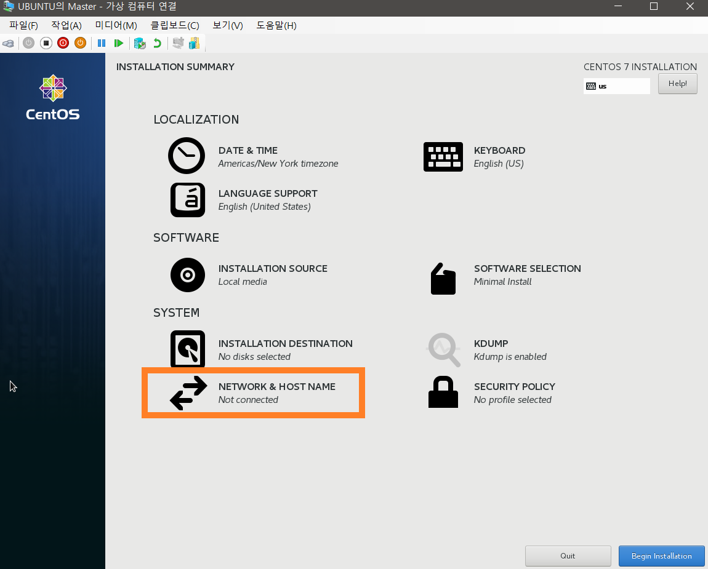

- Newwork 연결 테스트 

  - Network Adaptor (eth0) > ON > "Connected" 확인 
  - 연결 성공시 IP Address, Subnet Mask, Gateway, DNS 자동 부여
  - 설치 완료 후 고정 IP로 변경, hostname 변경

  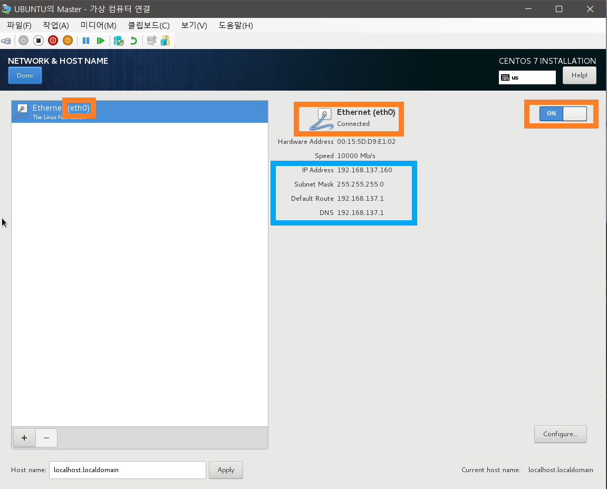

- 연결 실패시 PC의 기본 스위치를 가상 스위치에 공유 하도록 설정

  - 제어판 > 네트워크 및 공유 센터 > 활성 네트워크에서 기본 스위치 선택

    .png)

  - 속성 선택

    .png)

  - 공유 탭 선택

    .png)

  - "인터넷 연결 공유" Check,  공유하고자하는 가상 스위치 선택

    .png)

  - "확인" 선택 후 다시 CentOS 설치 화면으로 돌아가 Network 연결 테스트

- Network 연결 점검 완료 후 "Begin Install" 선택

  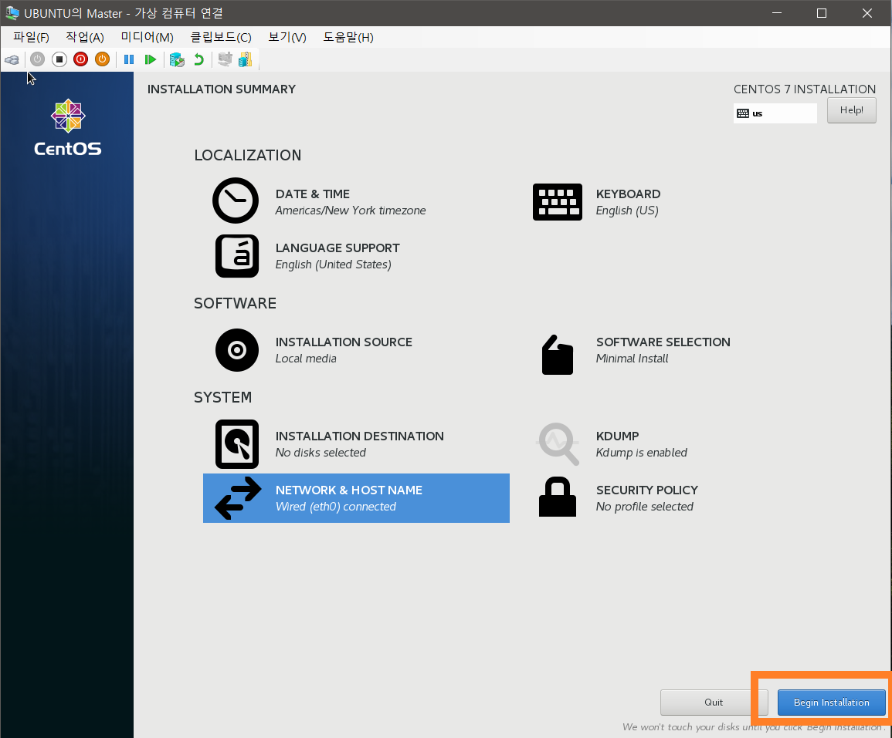

- Root Password & User 생성

  - root password만 생성 하는 것으로 진행

  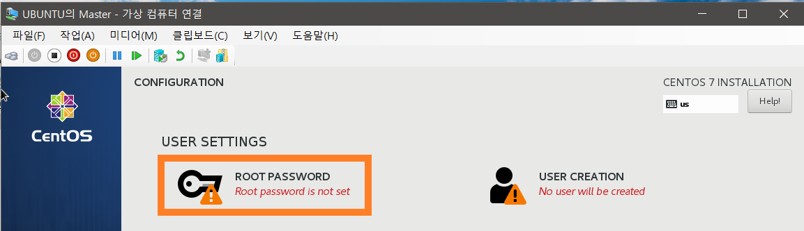

  

- 설치가 완료되면 "Reboot"

  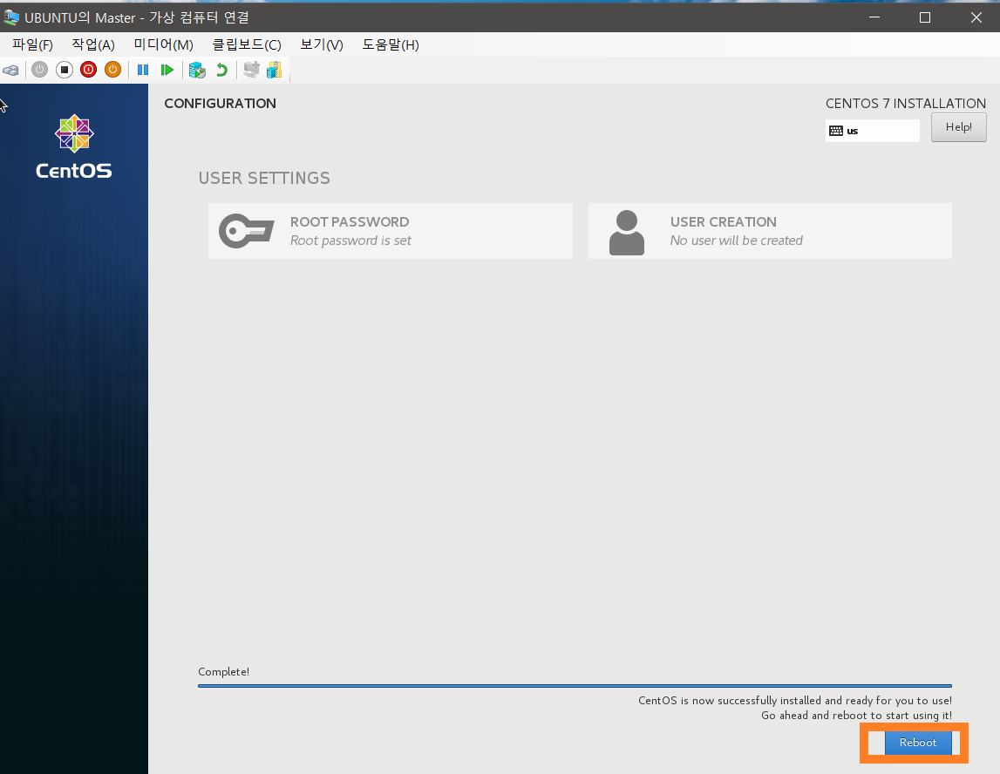

- login 화면이 나타나면 설치 완료 

  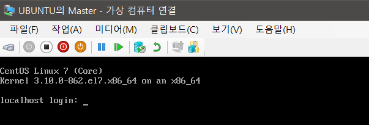

- 고정 IP로 변경 

  - 기본 스위치 확인

    ```sh
    ip addr
    ```

    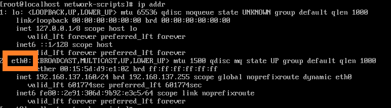

  - 기본 스위치 eth0 인것을 확인할 수 있으며 해당 스위치의 IP를 고정 IP로 설정

  ```sh
  cd /etc/sysconfig/network-scripts
  vi ifcfg-eth0        
  ```

  - BOOTPROTO="dhcp" --> "none"로변경

  - IP 주소, Gateway, DNS, Prefix 정보 추가하고 저장

    ```sh
    IPADDR=192.168.137.100
    PREFIX=24
    GATEWAY=192.168.137.1
    DNS1=192.168.137.1
    ```

  - Network 재시작

    ```sh
    systemctl restart network
    ```

  - IP 변경 확인

    ```sh
    ip addr
    ```

    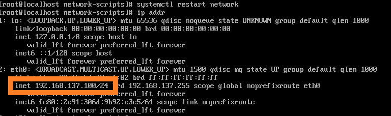

- hostname 변경

  ```sh
  hostnamectl set-hostname master
  ```

  - hostname은 system 재시작 후 적용되므로 reboot

    ```sh
    shutown -r now
    ```

  - hostname 변경된 것을 확인 login prompt 및 login 완료 후 prompt

    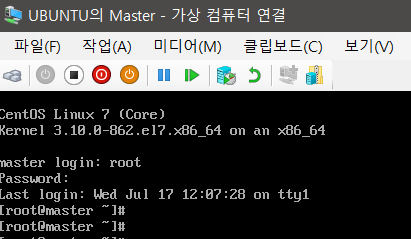

  - hostname 파일로 확인

    ```sh
    cat /etc/hostname
    ```

    