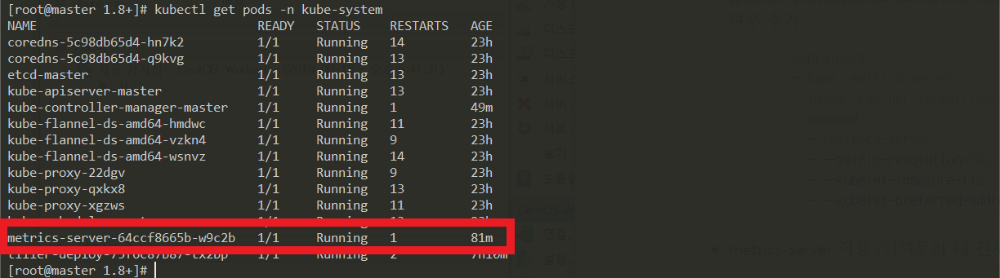

# Prime Mover 교육과정 #

​    고객서비스본부 고객5G&CoE팀 진광철

------

[TOC]

------

### Auto Scale  ###

### 1. kube-controller-manager에 auto scale 사용 설정

- vi /etc/kubernetes/manifests/kube-controller-manager.yaml

  spec.containers.command 에 horizontal-pod-autoscaler-* 추가

  ```sh
  spec:
    containers:
    - command:
      - kube-controller-manager
      - --allocate-node-cidrs=true
      - --authentication-kubeconfig=/etc/kubernetes/controller-manager.conf
      - --authorization-kubeconfig=/etc/kubernetes/controller-manager.conf
      - --bind-address=127.0.0.1
      - --client-ca-file=/etc/kubernetes/pki/ca.crt
      - --cluster-cidr=10.244.0.0/16
      - --cluster-signing-cert-file=/etc/kubernetes/pki/ca.crt
      - --cluster-signing-key-file=/etc/kubernetes/pki/ca.key
      - --controllers=*,bootstrapsigner,tokencleaner
      - --kubeconfig=/etc/kubernetes/controller-manager.conf
      - --leader-elect=true
      - --node-cidr-mask-size=24
      - --requestheader-client-ca-file=/etc/kubernetes/pki/front-proxy-ca.crt
      - --root-ca-file=/etc/kubernetes/pki/ca.crt
      - --service-account-private-key-file=/etc/kubernetes/pki/sa.key
      - --use-service-account-credentials=true
      - --horizontal-pod-autoscaler-use-rest-clients=true
      - --horizontal-pod-autoscaler-upscale-delay=0m20s
      - --horizontal-pod-autoscaler-downscale-delay=1m0s
      - --horizontal-pod-autoscaler-sync-period=0m10s
      image: k8s.gcr.io/kube-controller-manager:v1.15.2
  ```

  파일 저장시 kbue-control-manager는 자동 재시작되어 적용됨.

2. metrics-server 설치

   - cpu, memory 등 자원 수집을 위해 metrics server를 설치해야 함

   - git에서 설치용 yml 파일 다운로드

     ```sh
     git clone https://github.com/kubernetes-incubator/metrics-server
     ```

   - kubernetes 자체 인증 사용, node간 통신시 내부 ip 사용으로 설정 변경

     - kubernetes 버전이 1.8이상이면 metrics-server/deploy/1.8+/ 디렉토리의 yml을 사용한다.

       ```sh
       cd metrics-server/deploy/1.8+/
       vi metrics-server-deployment.yaml
       ```

     - spec.template.spec.containers.name.command 에 자체 인증여부및 internal ip 사용여부 추가

       ```sh
             containers:
             - name: metrics-server
               image: k8s.gcr.io/metrics-server-amd64:v0.3.3
               command:
               - /metrics-server
               - --metric-resolution=30s
               - --kubelet-insecure-tls
               - --kubelet-preferred-address-types=InternalIP
       ```

     - metrics-server 적용 (디렉토리 내 전체 yml 파일 적용)

       ```sh
       kubectl apply -f . 
       ```

     - metrics-server는 kube-system 네임스페이스에 생성되며 정상 배포 되었는지 확인

       ```sh
       kubectl get pods -n kube-system
       ```

       

       ```sh
       kubectl describe pod metrics-server-64ccf8665b-w9c2b -n kube-system
       ```

       .png)

     - 정상적으로 되었을 때 top nodes/pods 로 확인 가능

       .png)


### 2. hpa 설정

- HorizontalPodAutoscaler 적용

  - vi 05-autoscale.yml

    ```sh
    apiVersion: autoscaling/v1
    kind: HorizontalPodAutoscaler
    metadata:
      name: kubernetes-scaleout-app-hpa
      namespace: springboot-prj-myapp
    spec:
      maxReplicas: 3
      minReplicas: 1
      scaleTargetRef:
        apiVersion: apps/v1
        kind: Deployment
        name: myapp-spring-boot-docker-deployment
      targetCPUUtilizationPercentage: 30
    ```

    maxReplicas  <-  scaleout을 최대 3개까지 scale out하도록 지정

    kind: Deployment   <- Deployment 단위로 scale out하도록 지정

    name: myapp-spring-boot-docker-deployment  <- scale out 할 delployment 명 지정

    targetCPUUtilizationPercentage: 30  <-- cpu 부하 30% 초과시 scale out 하도록 지정

  - hpa 적용

    ```sh
    kubectl apply -f 05-autoscale.yml
    ```

    .png)

    위 빨간 박스의 Targets에 <unknown>으로 표시되면 정상적으로 적용이 되지 않은 것이므로 hpa의 상태를 확인하여야 함.

    ```sh
    kubectl describe hpa -n springboot-prj-myapp
    ```

    .png)

    정상적일 때의 hpa 적용 내용


### 3. 부하 발생하여 auto scale 작동 여부 확인

- 부하 발생용 서비스 작성

  지난 시간에 작성했던 myApp에 부하 발생용 서비스 추가

  - myApp/src/main/java/com/example/myApp/DemoApplication.java

    ```sh
         @RequestMapping("/mytest")
            public String mytest()
            {
                //log.debug("called mytest serivce");
 
                String value = "";
             double dval = 0.001;
                for(int i = 0; i < 10000; i++)
             {
                    dval = Math.sqrt(dval);
                 value += "test";
                }
    
                return String.format("%.0f", dval); //"myApp : Hello World! - test ";
         }
    ```

  - 빌드 및 배포 

    spring boot DemoApplication 배포와 동일하므로 자세한 내용은 생략

    ```sh
 [root@master myApp]# mvn spring-boot:run
    [root@master myApp]# mvn clean package
    [root@master myApp]# java -jar target/myApp-0.0.1-SNAPSHOT.jar
    [root@master myApp]# docker build --tag privateregistry:5000/myapp:latest .
    [root@master myApp]# docker push privateregistry:5000/myapp
    ```

    

- 부하 발생

  ```sh
  while true; do curl http://my.springtest/mytest; done
  ```

- hpa 상태 변경 모니터링

  ```sh
  kubectl get hpa -n springboot-prj-myapp -w
  ```

  .png)

  cput 부하 증가하면서 replicas 증가하는 것을 볼 수 있고, 부하 감소하면서 replicas 감소하는 것을 볼 수 있다

- pod 증가 확인

  ```sh
  kubectl get pods -n springboot-prj-myapp
  ```

  .png)

  pod가 3개로 증가한 모습을 볼 수 있다


